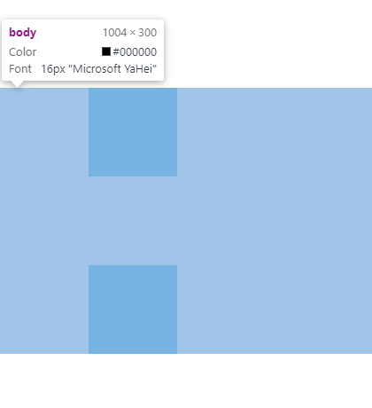
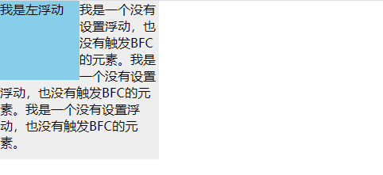

# 1 常见定位方案

- 普通流（normal flow）

在普通流中，元素按照其在HTML中的先后位置至上而下布局，在这个过程中，行内元素水平排列，知道当行被占满然后换行，**块级元素则被渲染为完整的一个新行**，除非另外指定，否则所有元素默认都是普通流定位，也可以说，普通流中元素的位置由该元素在HTML文档中的位置决定。

- 浮动（float）

在浮动布局中，元素首先按照普通流的位置出现，**然后根据浮动的方向尽可能的向左边或右边偏移**。其效果与印刷排版中的文本环绕相似。

- 绝对定位（absolute positioning）

在绝对定位布局中，**元素会整体脱离普通流**，因此绝对定位元素不会对其兄弟元素造成影响，而**元素具体的位置由绝对定位的坐标决定**。

# 2 BFC概念

## 2.1 格式化上下文

Formatting context是W3C CSS2.1 规范中的一个概念。它是页面中的一块渲染区域，并且有一套渲染规则，它决定了其子元素将如何定位，以及和其他元素的关系和相互作用。

## 2.2 块级格式化上下文

BFC即Block Formatting Contexts。

**具有BFC特性的元素可以看作是隔离了的独立容器，容器里面的元素不会在布局上影响到外面的元素，并且BFC具有普通容器所没有的一些特性**。

# 3 触发BFC

只要元素满足下面任一条件即可触发BFC特性：

- body根元素

- 浮动元素：float除none以外的值

- 绝对定位元素：position（absolute、fixed）

- display为inline-block、table-cells、flex

- overflow除了visible以外的值（hidden、auto、scroll）

# 4 BFC特性及应用

### 4.1 同一个BFC下外边距会发生折叠

``` html
<head>
  <style>
    * {
      margin: 0;
      padding: 0;
    }

    div {
      width: 100px;
      height: 100px;
      background: skyblue;
      margin: 100px;
    }
  </style>
</head>

<body>
  <div></div>
  <div></div>
</body>
```



两个div元素都处于同一个BFC容器下（body元素），所以第一个div的下边距和第二个div的上边距发生了重叠，所以两个盒子之间距离只有100px，而不是200px。

这是一种规范：**如果想要避免外边距的重叠，可以将其放在不同的BFC容器中**。

``` html
<head>
  <style>
    * {
      margin: 0;
      padding: 0;
    }

    .container {
      overflow: hidden;
    }

    p {
      width: 100px;
      height: 100px;
      background: skyblue;
      margin: 100px;
    }
  </style>
</head>

<body>
  <div class="container">
    <p></p>
  </div>
  <div class="container">
    <p></p>
  </div>
</body>
```

### 4.2 可以包含浮动的元素（清除浮动）

浮动的元素会脱离普通文档流

``` html
<head>
  <style>
    * {
      margin: 0;
      padding: 0;
    }

    .container {
      border: 1px solid #000;
      margin-top: 10px;
    }

    .inner {
      width: 100px;
      height: 100px;
      background: blue;
      float: left;
    }
  </style>
</head>

<body>
  <div class="container">
    <div class="inner"></div>
  </div>
</body>
```


由于容器内元素浮动，脱离了文档流，所以容器只剩下2px的border高度，如果想让容器包裹着浮动元素，可以触发容器的BFC

给`.container`设置`overflow: hidden;`来触发BFC

### 4.3 BFC可以阻止元素被浮动元素覆盖

这是一个文字环绕效果

``` html
<head>
  <style>
    * {
      margin: 0;
      padding: 0;
    }

    .left {
      height: 100px;
      width: 100px;
      float: left;
      background: skyblue;
    }

    .right {
      width: 200px;
      height: 200px;
      background: #eee;
    }
  </style>
</head>

<body>
  <div class="left">我是左浮动</div>
  <div class="right">
    我是一个没有设置浮动，也没有触发BFC的元素。我是一个没有设置浮动，也没有触发BFC的元素。我是一个没有设置浮动，也没有触发BFC的元素。
  </div>
</body>
```



第二个元素有部分被浮动元素所覆盖（文本信息不会被浮动元素覆盖），如果想避免元素被覆盖，可触发第二个元素的BFC特性，在第二个元素中加入`overflow: hidden`，就会变成两列布局

这个方法就可以用来实现两列自适应布局，左边的宽度宽度固定，右边的内容自适应。
