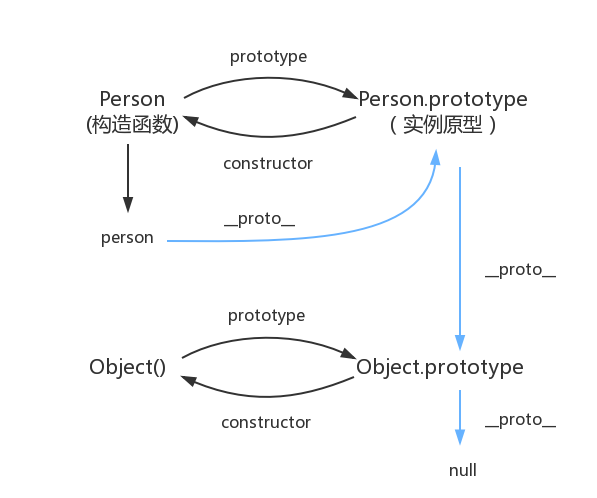

# 1 原型与原型链

先看一道题目

``` js
var A = function() {};
A.prototype.n = 1;
var b = new A();
A.prototype = {
  n: 2,
  m: 3
}
var c = new A();

console.log(b.n);
console.log(b.m);

console.log(c.n);
console.log(c.m);
```

输出结果为：
``` js
1
undefined
1
3
```

## 1.1 prototype

**<font color=red>每个函数都有一个prototype属性</font>**。
``` javascript
function Person() {

}
Person.prototype.name = 'Panda'
var person1 = new Person()
var person2 = new Person()
console.log(person1.name)    // Panda
console.log(person2.name)    // Panda
```

- 其实，函数的prototype属性指向了一个对象，这个对象正是调用该构造函数而创建的**实例**的原型，也就是person1和person2的原型。
- **原型**：每一个JavaScript对象（null除外）在创建的时候就会与之**关联**另一个对象，这个对象就是我们所说的原型，每一个对象都会从原型“继承”属性。

## 1.2 \_\_proto\_\_

**<font color=red>这是每一个JavaScript对象（除了null）都具有的一个属性</font>**，叫__proto__，这个属性会指向该对象的原型，我们使用方法的时候就会沿着__proto__去寻找。
``` javascript
function Person() {

}
var person = new Person()
console.log(person.__proto__ === Person.prototype)    //true
```

**查找机制**

1. 当访问一个对象的属性（方法）时，首先查找这个对象自身有没有该属性或者方法
2. 如果没有就查找它的原型（也就是__proto__指向的prototype原型对象）
3. 如果还没有就查找原型对象的原型
4. 依此类推，一直找到Object为止（null是顶端）

## 1.3 constructor 

**<font color=red>每一个原型都有一个constructor属性指向关联的构造函数。</font>**
``` javascript
function Person() {

}
console.log(Person === Person.prototype.constructor)    //true
```

## 1.4 in和hasOwnProperty

- `in`判断属性是否存在于对象上（包含原型对象）

- `hasOwnProperty`判断对象实例是否具有某个属性（不包含原型对象）

## 1.5 for-in、Object.keys和Object.getOwnPropertyNames

- `for-in`遍历对象所有可遍历的属性，包括原型链

- `Object.keys`返回对象实例上所有可遍历属性，不包括原型链

- `Object.getOwnPropertyNames`返回对象实例中所有属性，无论是否可遍历
                            
``` js
function Person() {}
Person.prototype.name = 'panda';
const panda = new Person();
console.log('name' in panda); // true
console.log(panda.hasOwnProperty('name')) // false
```

综合来讲就是下面这张图



最后再整一个题看看

``` js
function Test() {}
Object.prototype.printName = function() {
  console.log('Object');
}
Function.prototype.printName = function() {
  console.log('Function');
}
Test.printName(); // Function
var obj = new Test();
obj.printName();  // Object
```

# 2 继承

> JavaScript中实现继承的方法是复制父类的属性和方法来重写子类原型对象

在继承中，我们一定要解决的就是this指向、引用指向等问题，我们来通过不同继承方法一步一步的完善

## 2.1 原型链继承

``` js
function fatherFn() {
  this.text = "父类的this";
}
fatherFn.prototype.fatherFnText = "父类原型对象的属性或方法";
function sonFn() {
  this.panda = "子类的this";
}
sonFn.prototype = new fatherFn(); // fatherFn的实例赋值给sonFn的原型
sonFn.prototype.sonFnText = "子类原型对象的属性或方法";
const sonInstance = new sonFn();
console.log(sonInstance);
```
输出的结果：
``` js
sonFn
  panda: "子类的this"
  __proto__: fatherFn
    sonFnText: "子类原型对象的属性或方法"
    text: "父类的this"
    __proto__:
      fatherFnText: "父类原型对象的属性或方法"
      constructor: ƒ fatherFn()
      __proto__: Object
```

**原型链继承获取父类的属性和方法**

1. `fatherFn`通过this声明的属性/方法都会绑定在`new`期间创建的新对象上

2. 新对象的原型是`fatherFn.prototype`，通过原型链可以查到`fatherFn.prototype`的属性和方法

**new做了什么？**

1. 创建一个全新的对象

2. 这个新对象的原型(\_\_proto\_\_)指向函数的`prototype`对象

3. 执行函数，函数的this会绑定在新创建的对象上

4. 如果函数没有返回其他对象，那么会自动返回这个新对象

5. 返回的那个对象为构造函数的实例

**原型链继承的缺点**

1. **父类使用this声明的属性被所有实例共享**。

2. 创建子类实例时，无法向父类构造函数传参，不够灵活。

## 2.2 借用构造函数继承(call)

``` js
function fatherFn(...arr) {
  this.text = "父类的this属性";
  this.params = arr;
}
fatherFn.prototype.fatherFnText = "父类原型对象的属性或者方法";
function sonFn(fatherParams, ...sonParams) {
  fatherFn.call(this, ...fatherParams); // 将fatherFn的this指向sonFn
  this.panda = "子类的this属性";
  this.sonFn = sonParams;
}
sonFn.prototype.sonFnText = "子类原型对象的属性或者方法";
let fatherParamsArr = ['父类的参数1', '父类的参数2'];
let sonParamsArr = ['子类的参数1', '子类的参数2'];
const sonFnInstance = new sonFn(fatherParamsArr, ...sonParamsArr); // 实例化子类
console.log('借用构造函数子类实例', sonFnInstance);
```

**借用构造函数继承做了什么？**

1. 在子类中使用`call`调用父类，fatherFn将会被立即执行，并且将fatherFn函数的this指向sonFn的this。
2. 因为函数执行了，所以**fatherFn使用this声明的函数都会被声明到sonFn的this对象下**。
3. 实例化子类，this将指向new期间创建的新对象，返回该新对象。
4. 对fatherFn.prototype没有任何操作，无法继承。

**优点**

1. 可以向父类传递参数

2. 解决了原型链继承中：父类属性使用this声明的属性会在所有实例共享的问题

**缺点**

1. 能继承父类通过this声明的属性/方法，**不能继承父类prototype上的属性/方法**

2. 父类方法无法复用：因为无法继承父类的`prototype`，所以每次子类实例化都要执行父类函数，重新声明父类this里所定义的方法，因此方法无法复用

## 2.3 组合继承（call+new）

**原理**

使用原型链继承（new）将this和prototype声明的属性/方法继承至子类的prototype上，使用借用构造函数来继承父类通过this声明属性和方法至子类实例的属性上

``` js
function fatherFn(...arr) {
  this.some = "父类的this属性";
  this.params = arr;
}
fatherFn.prototype.fatherFnSome = "父类原型对象的属性或方法";
function sonFn() {
  fatherFn.call(this, '借用构造继承', '第二次调用');
  this.panda = '子类的this属性';
}
sonFn.prototype = new fatherFn('原型链继承', '第一次调用');
sonFn.prototype.sonFnSome = '子类原型对象的属性或者方法';
const sonFnInstance = new sonFn();
console.log('组合继承子类实例', sonFnInstance);
```

``` js
sonFn
  panda: "子类的this属性"
  params: (2) ["借用构造继承", "第二次调用"]
  some: "父类的this属性"
  __proto__: fatherFn
    params: (2) ["原型链继承", "第一次调用"]
    some: "父类的this属性"
    sonFnSome: "子类原型对象的属性或者方法"
    __proto__: Object
```
可以看到fatherFn通过this声明的属性/方法。。在子类实例的属性上，和其原型上都复制了一份，原因在代码中也有注释：
1. **原型链继承**：父类通过this和prototype声明的属性/方法继承至子类的prototype上
2. **借用构造继承**：父类通过this声明属性和方法继承至子类实例的属性上

**优点**

完整继承：

1. 父类通过this声明属性/方法被子类实例共享的问题(原型链继承的问题) 每次实例化子类将重新初始化父类通过this声明的属性，实例根据原型链查找规则，每次都会
2. 父类通过prototype声明的属性/方法无法继承的问题(借用构造函数的问题)。

**缺点**

1. 两次调用父类函数（`new fatherFn()`和`fahterFn.call(this)`），造成一定的性能损耗
2. 因调用两次父类，导致父类通过this声明的属性/方法，生成两份的问题
3. 原型链上下文丢失；子类和父类通过prototype声明的属性/方法都存在于子类的prototype上

## 2.4 原型式继承

**继承对象原型-Object.create()实现**
``` js
function cloneObject(obj) {
  function F(){}
  F.prototype = obj;  // 将被继承的对象作为空函数的prototype 
  return new F(); // 返回new期间创建的新对象，此对象的原型为被继承的对象，通过原型链找可以拿到被继承对象的属性
}
```

**优点**

兼容性好，最简单的对象继承

**缺点**

1. 因为旧对象是实例对象的原型，多个实例共享被继承对象的属性，存在篡改的可能
2. 无法传参

## 2.5 寄生式继承

> 创建一个仅用于封装继承过程的函数，该函数在内部以某种方式来增强对象，最后返回对象

``` js
function createAnother(original) {
  var clone = Object.clone(original); //继承一个对象 返回新函数
  // do somethin 以某种方式来增强对象
  clone.some = function(){};
  clone.panda = '封装继承过程';
  return clone;
}
```

**使用场景**：专门为对象来做某种固定方式的增强

## 2.6 寄生组合式继承（call+寄生式封装）

**寄生组合式继承原理**

1. 使用借用构造函数（call）来**继承父类this声明的属性/方法**
2. 通过寄生式封装函数设置父类prototype为子类prototype的原型来**继承父类的prototype声明的属性/方法**

``` js
function fatherFn(...arr) {
  this.some = '父类的this属性';
  this.params = arr;
}
fatherFn.prototype.fatherFnSome = '父类原型对象的属性或者方法';
function sonFn() {
  fatherFn.call(this, '借用构造继承');  // 核心1 借用构造继承：继承父类通过this声明属性和方法至子类实例的属性上
  this.panda = '子类的this属性';
}
// 核心2 寄生式继承：封装了son.prototype对象原型式继承father.prototype的过程，并且增强了传入的对象
function inheritPrototype(son, father) {
  const fatherFnPrototype = Object.create(father.prototype);
  son.prototype = fatherFnPrototype;
  son.prototype.constructor = son;
}
inheritPrototype(sonFn, fatherFn);
sonFn.prototype.sonFnSome = '子类原型对象的属性或者方法';
const sonFnInstance = new sonFn();
console.log(sonFnInstance);
```
实例
``` js
sonFn
  panda: "子类的this属性"
  params: ["借用构造继承"]
  some: "父类的this属性"
  __proto__: fatherFn
    constructor: ƒ sonFn()
    sonFnSome: "子类原型对象的属性或者方法"
    __proto__:
      fatherFnSome: "父类原型对象的属性或者方法"
      constructor: ƒ fatherFn(...arr)
      __proto__: Object
```

**寄生组合式继承是最成熟的继承方式**：

1. 只调用一次父类Father构造函数
2. 避免在子类的prototype上创建不必要多余的属性
3. 使用原型式继承父类的prototype，保持了原型链上下文不变。子类的prototype只有子类通过prototype声明的属性/方法和父类prototype上的属性/方法泾渭分明

## 2.7 extends继承

> ES6继承的原理跟寄生组合式继承是一样的

**ES5继承与ES6继承的区别**：

- ES5的继承实质上是**先创建子类的实例对象，再将父类的方法添加到this上**。

- ES6的继承是**先创建父类的实例对象this，再用子类的构造函数修改this**。 （<font color=red>ES6可以继承内置函数</font>）

# 3 扩展

## 3.1 constructor的作用

**返回创建实例对象的Object构造函数的引用**

某些场景下，我们对实例对象经过多轮导入导出，我们不知道实例是从哪个函数中构造出来或者追踪实例的构造函数，较为艰难。
保持constructor指向的一致性：
因此每次重写函数的prototype都应该修正一下constructor的指向，以保持读取constructor行为的一致性。
