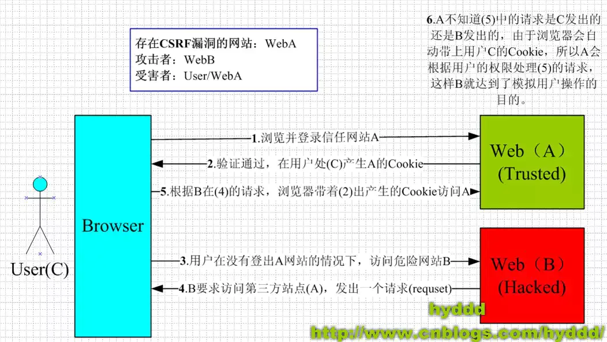

# 1 XSS攻击

## 1.1 什么是XSS

Corss-Site-Scripting（跨站脚本攻击）简称 XSS，是一种**代码注入攻击**。攻击者通过在目标网站上注入恶意脚本，使之在用户的浏览器上运行。利用这些恶意脚本，攻击者可获取用户的敏感信息如 Cookie、SessionID 等，进而危害数据安全。

## 1.2 XSS攻击的分类

**存储型XSS（持久性XSS）**

- 攻击步骤：

  1. 攻击者将恶意代码提交到目标网站的数据库中。

  2. 用户打开目标网站时，网站服务端将恶意代码从数据库取出，拼接在HTML中返回给浏览器。

  3. 用户了接收到响应后解析，混在其中的恶意代码也被执行。

  4. 恶意代码窃取用户数据并发送道攻击者的网站，或者冒充用户的行为，调用目标网站接口执行攻击者指定的操作。

- 常见于：带有用户保存数据的网站功能，如论坛发帖、商品评论、用户私信等。

- 危害：隐蔽性高，**它不需要用户手动触发。任何允许用户存储数据的web程序都可能存在存储型XSS漏洞**，当攻击者提交一段XSS代码后，被服务器端接收并存储，当所有浏览者访问某个页面时都会被XSS。

**反射型XSS（非持久性XSS）**

- 攻击步骤：
  
  1. 攻击者构造出特殊的URL，其中包含恶意代码。

  2. 用户打开带有恶意代码的URL时，网站服务端将恶意代码从URL中取出，拼接在HTML中返回给浏览器。 

  3. 用户浏览器接受收响应后解析执行，混在其中的恶意代码也被执行。

  4. 恶意代码窃取用户数据并发送到攻击者的网站，或者冒充用户的行为，调用目标网站接口执行攻击者指定的操作。

> 反射型XSS跟存储型XSS的区别是：存储型XSS的恶意代码存在数据库里，反射型XSS的恶意代码存在URL里。

- 常见于：网站搜索、跳转等。

- 危害：诱导用户点击。

**DOM型XSS**

- 攻击步骤：

  1. 攻击者构造出特殊的URL，其中包含恶意代码。

  2. 用户打开带有恶意代码的URL。

  3. 用户浏览器接受到响应后解析执行，前端JavaScript取出URL中的恶意代码并执行。

  4. 恶意代码窃取用户数据并发送到攻击者的网站，或者冒充用户的行为，调用目标网站接口执行攻击者指定的操作。

> DOM型XSS攻击中，取出和执行恶意代码由浏览器端完成，属于前端JavaScript自身的安全漏洞

## 1.3 防御XSS

**常用防范方法**

- **httpOnly**：在 cookie 中设置 HttpOnly 属性后，js脚本将无法读取到 cookie 信息。

- **输入过滤**

- **转义HTML**：如果拼接 HTML 是必要的，就需要对于引号，尖括号，斜杠进行转义,但这还不是很完善。

- **白名单**：对于显示富文本来说，不能通过上面的办法来转义所有字符，因为这样会把需要的格式也过滤掉。这种情况通常采用白名单过滤的办法，当然也可以通过黑名单过滤，但是考虑到需要过滤的标签和标签属性实在太多，更加推荐使用白名单的方式。

**预防存储型和反射型XSS攻击**

- 改成纯前端渲染，把代码和数据分隔开

  - 先加载一个静态HTML，此HTML中不包含任何跟业务相关的数据。

  - 浏览器执行HTML中的JavaScript。

  - JavaScript通过Ajax加载业务数据，调用DOM API更新到页面上

- 对HTML做充分转义

**预防DOM型XSS攻击**

- 在使用`.innerHTML`、`.outHTML`、`document.write()`时要特别小心，不要把不可信的数据作为HTML插到页面上，而应尽量使用`.textContent`、`.setAttribute()`等。

- DOM 中的内联事件监听器，如 `location`、`onclick`、`onerror`、`onload`、`onmouseover` 等，`<a>` 标签的 href 属性，JavaScript 的 `eval()`、`setTimeout()`、`setInterval()` 等，都能把字符串作为代码运行。如果不可信的数据拼接到字符串中传递给这些 API，很容易产生安全隐患，请务必避免。

# 2 CSRF跨站点请求伪造

## 2.1 什么是CSRF

跨站请求伪造（英语：Cross-site request forgery），也被称为 one-click attack 或者 session riding，通常缩写为 CSRF 或者 XSRF， 是一种**挟制用户在当前已登录的 Web 应用程序上执行非本意的操作的攻击方法**。如:攻击者诱导受害者进入第三方网站，在第三方网站中，向被攻击网站发送跨站请求。利用受害者在被攻击网站已经获取的注册凭证，绕过后台的用户验证，达到冒充用户对被攻击的网站执行某项操作的目的。

## 2.2 CSRF攻击流程

要完成一次CSRF攻击，受害者必须依次完成两个步骤：

1. 登录受信任网站A，并在本地生成Cookie。

2. 在不登出A的情况下，访问危险网站B。

## 2.3 常见的CSRF攻击类型

- **GET类型的CSRF**：只需要一个HTTP请求

- **POST类型的CSRF**：通常使用的是一个自动提交的表单。**后端接口不能将安全寄托仅允许POST上面。**

- **链接类型的CSRF**

## 2.4 CSRF的特点

- 攻击一般发起在第三方网站，而不是被攻击的网站。被攻击的网站无法防止攻击发生。

- 攻击**利用受害者在被攻击网站的登录凭证，冒充受害者提交操作**；而不是直接窃取数据。

- 整个过程攻击者并不能获取到受害者的登录凭证，仅仅是“冒用”。

- 跨站请求可以用各种方式：图片URL、超链接、CORS、Form提交等等。部分请求方式可以直接嵌入在第三方论坛、文章中，难以进行追踪。

- **CSRF通常是跨域的**。但是如果本域下有容易被利用的功能，比如可以发图和链接的论坛和评论区，**攻击可以直接在本域下进行，而且这种攻击更加危险**。

## 2.5 CSRF与XSS区别

- 通常来说 **CSRF 是由 XSS 实现的**，CSRF 时常也被称为 XSRF（CSRF 实现的方式还可以是直接通过命令行发起请求等）。

- 本质上讲，**XSS 是代码注入问题**，**CSRF 是 HTTP 问题**。 **XSS 是内容没有过滤导致浏览器将攻击者的输入当代码执行**。**CSRF 则是因为浏览器在发送 HTTP 请求时候自动带上 cookie，而一般网站的 session 都存在 cookie里面(Token验证可以避免)**。

## 2.6 防御

- 验证码

- Referer check

- token