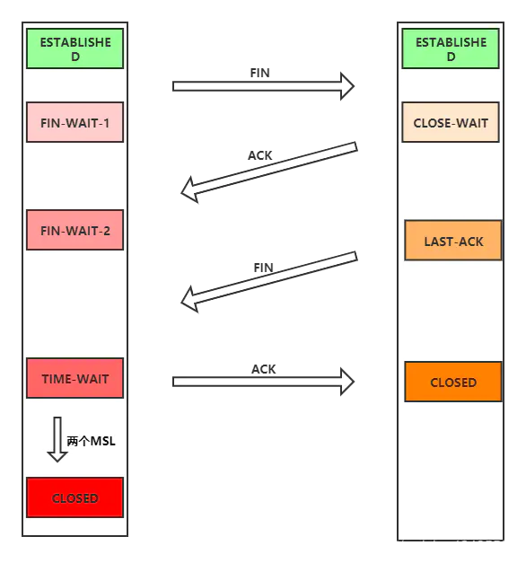

## 1. http和https的基本概念

**http**：超文本传输协议，是一个客户端和服务器端请求和应答的标准（TCP），用于从WWW服务器传输超文本到本地浏览器的传输协议，它可以使浏览器更加高效，使网络传输减少。

**https**：是以安全为目标的HTTP通道，简单讲是HTTP的安全版，即HTTP下加入SSL层。

## 2. https握手过程

1. 客户端发起请求（ClientHello）：客户端向服务端发起加密通信的请求
2. 服务器回应（ServerHello）：服务器收到客户端请求后，确认加密通信协议版本是否一致，如果版本一致则返回服务器证书，否则关闭加密通信
3. 客户端回应：客户端收到服务器回应后，客户端首先验证证书是否有效。如果证书失效，则会给访问者一个警示，由其决定是否继续连接。如果证书没失效，则使用证书中的公钥加密一个随机数(pre-master key)返回给服务器，同时返回客户端握手结束通知。
4. 服务器的最后回应：服务器收到客户端发来的pre-master key后，计算生成本次会话的“会话密钥”，向客户端发送服务器握手结束通知。

至此，握手阶段结束，接下来加密通信。

## 3. tcp三次握手概括

简易版：

- 第一次握手：S只可以确认自己可以接受C发送的报文段
- 第二次握手：C可以确认S收到了自己发送的报文段，并可以确认自己可以接受S发送的报文段
- 第三次握手：S可以确认C收到了自己发送的报文段

正式版：

- 第一次握手，客户端向服务器发送一个 SYN 连接请求报文段，报文段的首部中 SYN 标志位置为 1，序号字段是一个任选的 随机数。它代表的是客户端数据的初始序号。
- 第二次握手，服务器端接收到客户端发送的 SYN 连接请求报文段后，服务器首先会为该连接分配 TCP 缓存和变量，然后向 客户端发送 SYN ACK 报文段，报文段的首部中SYN 和 ACK 标志位都被置为 1，代表这是一个对 SYN 连接请求的确认， 同时序号字段是服器端产生的一个任选的随机数，它代表的是服务器端数据的初始序号。确认号字段为客户端发送的序号加 一。
- 第三次握手，客户端接收到服务器的肯定应答后，它也会为这次 TCP 连接分配缓存和变量，同时向服务器端发送一个对服务 器端的报文段的确认。第三次握手可以在报文段中携带数据。

## 4 tcp四次挥手概括

- A发送FIN包申请关闭连接，此时A进入`FIN-WAIT-1`状态，不会再向B端发送数据包

- B接收到FIN包后会立即回复ACK包，此时B进行`CLOSE-WAIT`状态

- A接收到B传输的ACK确认包后会将其状态修改为`FIN-WAIT-2`

- B检查自身是否还有数据需要发送，如果有将会发送完所有未发送数据，若无则发送FIN包进入`LAST-ACK`状态

- A接收到B的FIN包后会发送ACK包，进入`TIME-WAIT`状态等待

- 两个MSL时钟后A将会释放连接`CLOSED`

- B收到A传输的ACK确认包后将会直接释放连接进入`CLOSED`状态

TCP 使用四次挥手的原因是因为 TCP 的连接是全双工的，所以需要**双方分别释放到对方的连接**，单独一方的连接释放，只代表不能再向对方发送数据，连接处于的是半释放的状态。

最后一次挥手中，客户端会等待一段时间再关闭的原因，是为了**防止发送给服务器的确认报文段丢失或者出错，从而导致服务器端不能正常关闭**。

## 5. fetch发送两次请求的原因

fetch发送post请求，总是发送两次，第一次状态码204，第二次200
原因是因为第一次fetch发送了一个Options请求，询问服务器是否支持修改的请求头，如果服务器支持，则在第二次中发送真正的请求

## 6. 常用状态码

- 2XX (Success)

  - 200 OK
  > 表示从客户端发来的请求在服务器被正常处理了

  - 204 No Content
  > 代表服务器接收的请求已成功处理，但在返回的响应报文中不含实体的主体部分

   - 206 Partical Content
   > 表示客户端进行了范围请求，而服务器成功执行了这部分的GET请求响应报文中包含由Content-Range指定范围的实体内容

- 3XX (Redirection)

  - 301 Moved Permanently
  > 永久性重定向。会更新书签

  - 302 Found
  > 临时性重定向。资源不是被永久移动

  - 303 See Other
  > 表示由于请求对应的资源存在着另一个url，应使用GET方法定向获取请求的资源

  - 304 Not Modified
  > 表示客户端发送附带条件的请求时，服务器端允许请求访问资源，但未满足条件。304状态码返回时，不包含任何响应的主体部分

  - 307 Temporary Redirect
  > 临时重定向。禁止POST变成GET

- 4XX (Client Error)

  - 400 Bad Request
  > 表示报文中存在语法错误。需要修改内容后再次发送。浏览器会像200 OK一样对待该状态码

  - 401 Unauthorized
  > 表示发送的请求需要由通过HTTP认证的认证信息。如果之前进行过1次请求，表示用户认证失败

  - 403 Forbidden
  > 表明对请求资源的访问被服务器拒绝了。可能未获得文件系统的访问授权、访问权限出现问题

  - 404 Not Found
  > 表明服务器上无法找到请求的资源。也可以在服务器端拒绝请求且不想说明理由时使用

  - 405 Method Not Allowed
  > 表明客户端请求的方法虽然能被服务器识别，但是服务器禁止使用该方法。客户端可以通过Options方法查看允许的访问方法

- 5XX (Server Error)

  - 500 Internal Server Error
  > 表明服务器端在执行请求时发生了错误。也有可能是web应用存在bug或某些临时的故障

  - 502 Bad Gateway
  > 表明扮演网关或代理角色的服务器，从上游服务器中接收到的响应是无效的

  - 503 Service Unavailable
  > 表明服务器暂时处于超负载或正在进行停机维护，现在无法处理请求

## 7. 从地址栏里输入一个url，到这个页面渲染出来。中间会发生什么？

1. 判断地址栏的关键字是搜索内容还是url
2. 如果是url：浏览器进程通过通信把url请求发送给网络进程
3. 网络进程会查询本地缓存，如果有直接返回，没有则网络请求
4. 请求过程为DNS解析、TCP/IP建立连接、发送请求、服务器响应返回html
5. 渲染进程将HTML转化成DOM树，构建过程中遇到js脚本就停止构建去执行代码
6. 将CSS样式构建为一个CSSOM树，然后和DOM树合并为渲染树
7. 合成线程对渲染树进行分层、图层绘制、光栅化操作后发送DrawQuad给浏览器进程
8. 浏览器根据DrawQuad消息生成页面显示在显示器上

## 8. TCP和UDP的区别

1. TCP是面向连接的，UDP是无连接的
2. TCP连接传送的数据无差错、不丢失（**基于连续 ARQ 协议和滑动窗口协议**）；UDP不保证可靠交付
3. TCP面向字节流，UDP面向报文
4. TCP只能1对1的，UDP支持1对1，1对多
5. TCP的首部为20字节，UDP只有8字节

## 9. OSI七层模型

OSI参考模型 | 各层的解释
-|-
应用层 | 为应用程序提供服务
表示层 | 数据格式转化、数据加密
会话层 | 建立、管理和维护会话
传输层 | 建立、管理和维护端到端的连接
网络层 | IP地址及路由选择
数据链路层 | 提供介质访问和链路管理
物理层 | 物理层

## 10. TCP/IP五层模型

| TCP/IP五层模型 | 协议 |
|-|-|
| 应用层 | HTTP、FTP、SMTP |
| 传输层 | TCP、UDP、RTP、RSVP |
| 网络层 | IP、ICMP |
| 数据链路层 | Wi-Fi、PPP |
| 物理层 |  |

## 11. HTTP1.1 HTTP/2 and HTTP/3

**HTTP/1.1**

- **长连接**： HTTP1.1支持长连接和请求的流水线处理，在一个TCP连接上可以传送多个HTTP请求和响应，减少了建立和关闭连接的消耗和延迟，在HTTP1.1中默认开启长连接keep-alive，一定程度上弥补了HTTP1.0每次请求都要创建连接的缺点。

- **缓存信息**：    在HTTP1.0中主要使用header里的If-Modified-Since,Expires来做为缓存判断的标准，HTTP1.1则引入了更多的缓存控制策略例如Entity tag，If-Unmodified-Since, If-Match, If-None-Match等更多可供选择的缓存头来控制缓存策略

- **节约宽带**

**HTTP/2**

- **二进制协议**：HTTP/2 则是一个彻底的二进制协议，头信息和数据体都是二进制，并且统称为"帧"。
- **多路复用**：HTTP/2 实现了多路复用，HTTP/2 仍然复用 TCP 连接，但是在一个连接里，客户端和服务器都可以同时发送多个请求或回应，而且不用按照顺序一一发送，这样就免了"队头堵塞"的问题。
- **数据流**：HTTP/2 将每个请求或回应的所有数据包，称为一个数据流。每 个数据流都有一个独一无二的编号。数据包发送的时候，都必须标记数据流 ID ，用来区分它属于哪个数据流。
- **头信息压缩**： 一方面，头信息使用 gzip 或 compress 压缩后再发送；另一方面， 客户端和服务器同时维护一张**头信息表**，所有字段都会存入这个表，生成一个索引号，以后就不发送同样字段了，只发送索引 号，这样就能提高速度了。

**HTTP/3**

由于 TCP 本身存在的一些限制，Google 就开发了一个基于 UDP 协议的 QUIC 协议，并且使用在了 HTTP/3 上。 QUIC 协议在 UDP 协议上实现了多路复用、有序交付、重传等等功能。

## 12. ARQ协议

1. **停止等待ARQ协议**

   - **发送方**：每发送一个分组，就为这个分组设置一个定时器。当发送分组的确认 回答返回了，则清除定时器，发送下一个分组。如果在规定的时间内没有收到已发送分组的肯定回答，则重新发送上一个分组。

   - **接受方**：每次接受到一个分组，就返回对这个分组的肯定应答，当收到冗余的分组时，就直接丢弃，并返回一个对冗余 分组的确认。当收到分组损坏的情况的时候，直接丢弃。

   使用停止等待 ARQ 协议的缺点是**每次发送分组必须等到分组确认后才能发送下一个分组**，这样会造成信道的利用率过低。

2. **连续ARQ协议**

   1. **滑动窗口协议**
      - **发送方**：维持了一个发送窗口，发送窗口以前的分组是已经发送并确认了的分组，发送窗口中包含了**已经发送但未确认的分组和允许发送但还未发送的分组**，发送窗口以后的分组是缓存中还不允许发送的分组。当发送方向接收方发送分组时，会依次发送窗口内的所有分组，并且设置一个定时器，这个定时器可以理解为是最早发送但未收到确认的分组。**如果在定时器的时间内收到某一个分组的确认回答，则滑动窗口，将窗口的首部移动到确认分组的后一个位置**，此时如果还有已发送但没 有确认的分组，则重新设置定时器，如果没有了则关闭定时器。**如果定时器超时，则重新发送所有已经发送但还未收到确认的分组**。
      - **接收方：**使用的是**累计确认**的机制，对于所有按序到达的分组，接收方返回一个分组的肯定回答。如果收到了一个乱序的分组，那 么接收方会**直接丢弃**，并返回一个**最近的按序到达的分组的肯定回答**。使用累计确认保证了确认号以前的分组都已经按序到达了， 所以发送窗口可以移动到已确认分组的后面。
   2. **选择重传协议**
      - **发送方**：发送窗口的以前是已经发送并确认的分组，窗口内包含了已发送但未被确认的分组， 已确认的乱序分组，和允许发送但还未发送的分组，发送窗口以后的是缓存中还不允许发送的分组。选择重传协议与滑动窗口协议最大的不同是，**发送方发送分组时，为一个分组都创建了一个定时器**。当发送方接受到一个分组的确认应答后，取消该分组的 定时器，并判断接受该分组后，**是否存在由窗口首部为首的连续的确认分组，如果有则向后移动窗口的位置，如果没有则将该分组标识为已接收的乱序分组**。**当某一个分组定时器到时后，则重新传递这个分组**。
      - **接收方**：它会确认每一个正确接收的分组，不管这个分组是按序的还是乱序的，乱序的分组将被缓存下来，直到所有的乱序分 组都到达形成一个有序序列后，再将这一段分组交付给上层。对于不能被正确接收的分组，接收方直接忽略该分组。

## 13 TCP的拥塞控制

TCP 的拥塞控制主要使用了四个机制，分别是**慢启动**、**拥塞避免**、**快速重传**和**快速恢复**。

- **慢启动**：因为在发送方刚开始发送数据的时候，并不知道网络中的拥塞程度，所以先以较低的速率发送，进行试探 ，每次收到一个确认报文，就将发动窗口的长度加一，这样**每个 RTT 时间后，发送窗口的长度就会加倍**。当发送窗口的大小达 到一个阈值的时候就进入拥塞避免算法。
- **拥塞避免**：是为了避免可能发生的拥塞，将发送窗口的大小由每过一个 RTT 增长一倍，**变为每过一个 RTT ，长度只加一**。 这样将窗口的增长速率由指数增长，变为加法线性增长。
- **快速重传**：当发送方收到三个冗余的确认应答时，因为 TCP 使用的是累计确认的机制，所以很有可能是发生了报文段的 丢失，因此采用**立即重传**的机制，在**定时器结束前发送所有已发送但还未接收到确认应答的报文段**。
- **快速恢复**：对快速重传的后续处理，因为网络中可能已经出现了拥塞情况，所以会**将慢启动的阀值减小为原来的一半，然后将拥塞窗口的值置为减半后的阀值，然后开始执行拥塞避免算法，使得拥塞窗口缓慢地加性增大**。简单来理解就是，乘性减，加性增。

## 14 半连接全连接队列和SYN Flood攻击的关系

三次握手前，服务端的状态从`CLOSED`变为`LISTEN`, 同时在内部创建了两个队列：**半连接队列**和**全连接队列**，即**SYN队列**和**ACCEPT队列**。

### 半连接队列

当客户端发送`SYN`到服务端，服务端收到以后回复`ACK`和`SYN`，状态由`LISTEN`变为`SYN_RCVD`，此时这个连接就被推入了**SYN队列**，也就是**半连接队列**。

### 全连接队列

当客户端返回`ACK`, 服务端接收后，三次握手完成。这个时候连接等待被具体的应用取走，在被取走之前，它会被推入另外一个 TCP 维护的队列，也就是**全连接队列(Accept Queue)**。

### SYN Flood攻击原理

SYN Flood 属于典型的 DoS/DDoS 攻击。其攻击的原理很简单，就是用客户端在短时间内伪造大量不存在的 IP 地址，并向服务端疯狂发送`SYN`。对于服务端而言，会产生两个危险的后果:

1. 处理大量的`SYN`包并返回对应`ACK`, 势必有大量连接处于`SYN_RCVD`状态，从而占满整个**半连接队列**，无法处理正常的请求。
2. 由于是不存在的 IP，服务端长时间收不到客户端的`ACK`，会导致服务端不断重发数据，直到耗尽服务端的资源。

### 如何应对SYN Flood攻击？

1. 增加 SYN 连接，也就是增加半连接队列的容量。

2. 减少 SYN + ACK 重试次数，避免大量的超时重发。

3. 利用 SYN Cookie 技术，在服务端接收到`SYN`后不立即分配连接资源，而是根据这个`SYN`计算出一个Cookie，连同第二次握手回复给客户端，在客户端回复`ACK`的时候带上这个`Cookie`值，服务端验证 Cookie 合法之后才分配连接资源。

